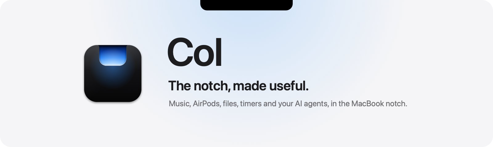
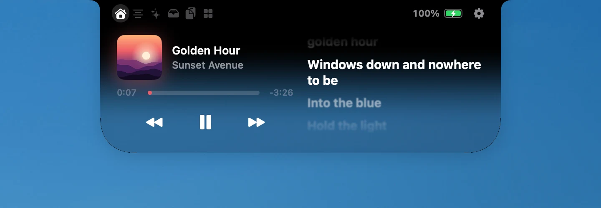
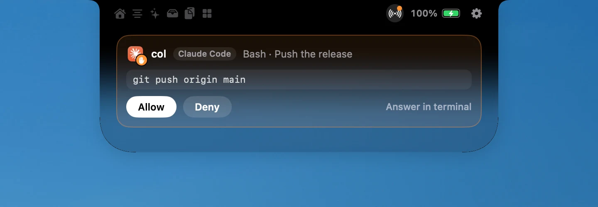

<p align="center">
  <picture>
    <source media="(prefers-color-scheme: dark)" srcset="docs/images/readme-header-dark.png">
    
  </picture>
</p>

<p align="center">
  <a href="LICENSE"></a>
  
  
  
  <a href="https://github.com/ruben4reall/islet/actions/workflows/ci.yml"></a>
</p>

# Islet

**The notch, made useful.**

[Website](https://getislet.vercel.app) · [Download for Mac](https://github.com/ruben4reall/islet/releases/latest/download/Islet.dmg) · [Changelog](CHANGELOG.md) · [API](docs/api.md)

Islet turns the camera cutout of your MacBook into a living island. While you work, it shows what matters beside the
camera: the song playing, your AirPods connecting, the volume, a build running, an AI agent waiting for you. Hover or
click, and it opens.

Islet is a free, open source Mac app, written in Swift. It does what the best notch apps do, then opens the notch to
your scripts and your AI agents.

<p align="center">
  
</p>

## What it does

- **Now playing.** Apple Music, Spotify, YouTube in your browser and any app that shows in Control Center, with the
  cover, a scrubber, the controls and the audio output. A cover and a live equalizer sit beside the camera while you
  work; swipe the closed island to skip a track.
- **Synced lyrics.** The words of the song beside the player, line by line, as Apple Music shows them, whatever plays:
  Spotify, Apple Music, Deezer or your browser. From LRCLIB, an open database, or your own `.lrc` files.
- **A prompter in the notch.** Your script comes out of the notch right under the camera, at the pace of your voice:
  it waits when you stop talking (Voice Pace), follows your words one by one (Voice Follow), rolls at a steady pace, or
  moves only when you move it. Recognition runs on your Mac, and the prompter stays out of screenshots, recordings and
  calls. Drive it with shortcuts, a presentation clicker or your phone. It was Souffleur, now part of Islet.
- **AirPods, by model.** Islet reads the model your headphones report (AirPods, AirPods Pro, AirPods Max, Beats) and
  shows each earbud and the case, or the headphones' single battery.
- **AI agents.** Claude Code, Codex, Gemini CLI, Cursor and GitHub Copilot in VS Code show in the notch while they
  work. When Claude Code or Codex asks for permission, the island opens with Allow and Deny. Islet never signs in to
  any AI service.
- **Volume and brightness.** A quiet gauge in the notch instead of the big square in the middle of the screen.
- **Files, clipboard, agenda.** A shelf for files with AirDrop, a clipboard history with pins kept in memory only, the
  next events of your day with a Join button for calls, and today's reminders.
- **Tools.** A timer that counts down in the wings, a colour picker, a camera mirror, system stats, keep awake,
  downloads.
- **Privacy at a glance.** The app using your microphone or camera, right where the camera is.
- **Programmable.** The `islet` command, a local API, `islet://` links, Shortcuts actions and extensions put your own
  live activities in the notch.
- **Never in the way.** The wings never cover a menu or a menu bar icon, the island steps aside in full screen, and on
  a Mac without a notch it floats just under the menu bar.
- **Liquid Glass.** On macOS 26 the open island stays black where it meets the notch and melts into glass toward its
  lower edge: Liquid (a clear pane that bends the desktop behind it), Transparent, Tinted or all Black, your choice,
  as for macOS's own glass.
- **Yours to shape.** Compose each page of the open island from widgets, one across it or two side by side, add pages,
  reorder them, choose what the closed island shows first, the size and the speed. A short welcome asks only for the
  permissions the modules you picked need.

<p align="center">
  
  
</p>

## Install

### Download

1. [Download Islet](https://github.com/ruben4reall/islet/releases/latest/download/Islet.dmg), open the disk image and
   drag Islet to Applications.
2. Open Islet. It says hello from the notch, then a short welcome shows the gestures and asks for the permissions the
   modules you chose need.

Releases are signed with a Developer ID and notarized by Apple.

### Homebrew

```sh
brew install --cask ruben4reall/tap/islet
```

The cask also links the `islet` command.

### Updates

Islet updates itself with [Sparkle](https://sparkle-project.org). The welcome asks whether to keep it up to date;
you can change your mind in Settings, About, or choose *Check for Updates…* from the island's right-click menu. Every
update is signed with Islet's own key.

### Uninstall

In Settings, Developers, disconnect your AI agents, so their settings files forget Islet. Then quit Islet from its
right-click menu and move it to the Trash. Its settings are in `~/Library/Preferences/ch.rubencatalao.islet.plist`.
With Homebrew: `brew uninstall --cask --zap islet`.

## Connect your AI agents

In Settings, Developers, click Connect next to each agent, or from a terminal:

```sh
islet hooks install --agent all      # every agent found on this Mac
islet hooks status
```

| Agent | Where Islet adds its hooks | In the notch |
|---|---|---|
| Claude Code | `~/.claude/settings.json` | Sessions, and permission requests with Allow and Deny |
| Codex | `~/.codex/hooks.json` | Sessions, and permission requests with Allow and Deny |
| Gemini CLI | `~/.gemini/settings.json` | Sessions, and a sign when Gemini waits for you |
| Cursor | `~/.cursor/hooks.json` | Agent sessions, their edits and commands |
| GitHub Copilot in VS Code (Local harness) | `~/.copilot/hooks/islet.json` | Sessions, prompts and tools; VS Code handles permissions |

Islet keeps a backup of every file it edits and leaves the rest untouched. Codex runs a new hook once you trust it with
`/hooks`. Copilot hooks are observational: VS Code applies each session's own permission mode, including bypass,
without Islet forcing an extra approval. This uses VS Code's Local agent harness; the Agent Host harness has a separate hook format.
If Islet is closed, hooks exit at once. Other agents or scripts can do the same, for example:
`islet agent Aider working --message "Refactoring"`.

## Programmable notch

```sh
islet push build --title "Build" --symbol hammer.fill --tint orange --progress 40%
islet done build
```

The command, the local API over a Unix socket that only your account can open, `islet://` links and extensions are
described in [docs/api.md](docs/api.md) and [docs/extensions.md](docs/extensions.md).

## Permissions

Each one only if a module you chose needs it:

- **Accessibility**, to take over the volume and brightness keys and to measure the menu bar, so the island never
  covers it.
- **Calendars and Reminders**, for the agenda.
- **Bluetooth**, for the battery and the model of your headphones.
- **Camera**, only while the mirror is open.

## Privacy

- No account, no telemetry, no analytics, no crash reports.
- One network connection: the update check, which you can turn off. Sparkle's system profile is off.
- The clipboard history lives in memory and skips copies that password managers mark as private.
- Scripts and agents reach Islet through a socket in your user folder, mode 0600. No network port.

[SECURITY.md](SECURITY.md) lists everything Islet touches on your Mac.

## Light on your Mac

| | Islet | Alcove | boring.notch | Atoll |
|---|---|---|---|---|
| Memory at rest | **15 MB** | 56 MB | 71 MB | 106 MB |
| Processor at rest | **0.004 %** | 0.01 % | 3.9 % | 6.8 % |

One minute idle after launch, helper processes included, on a 14-inch MacBook Pro (M3 Pro), macOS 26.5. While you use
the Mac, clipboard history checks the pasteboard every two seconds and Islet uses about 0.013 %. How it is measured:
[docs/benchmark.md](docs/benchmark.md).

The island is a borderless window exactly the size of the notch; its outline is a Core Animation shape morphed with
springs, and the wings are animations the system plays by itself. The pages are SwiftUI views created as the island
opens and thrown away as it closes, and the Liquid Glass under them only draws while the island is open.

## Compatible Macs

- macOS 14 Sonoma or later, Apple silicon and Intel.
- **In the notch** on MacBook Pro 14 and 16 inch (2021 and later) and MacBook Air 13 and 15 inch (M2 and later).
- **A floating island** just under the menu bar on every other Mac and on external displays.

## Private macOS APIs

Islet uses private macOS functions for six features. Each is looked up at runtime: if a macOS update removes one, its
feature turns off and nothing crashes.

| Feature | Functions | Why |
|---|---|---|
| Now playing | `MRMediaRemoteGetNowPlayingInfo`, `MRMediaRemoteSendCommand` and neighbours (MediaRemote) | Since macOS 15.4 only Apple-signed processes may read them: Islet's helper runs inside `/usr/bin/perl`. Approach from [ungive/mediaremote-adapter](https://github.com/ungive/mediaremote-adapter) (BSD 3-Clause), rewritten. |
| Brightness | `DisplayServicesGetBrightness`, `DisplayServicesSetBrightness` | Reading and setting the built-in display's brightness. |
| Headphone battery and model | `batteryPercentLeft`, `batteryPercentCase`, `productID` on `IOBluetoothDevice` | AirPods report them through properties IOBluetooth does not document. |
| Liquid glass of the open island | The `glassBackground` filter of `NSGlassEffectView` (Core Animation): its refraction and blur inputs | Liquid Glass can bend what lies behind it like a lens, but macOS turns that off on large panels and frosts them. Only inputs that exist are set: otherwise the glass stays Apple's own. |
| Transparent glass of the open island | `CABackdropLayer`, `CAFilter` (Core Animation) | A light blur of the desktop with a set strength: Liquid Glass has no setting clear enough to see through a panel this size. Without them, Transparent uses Liquid Glass. |
| Lock Screen (beta, off by default) | `SLSSpaceCreate`, `SLSSpaceSetAbsoluteLevel`, `SLSShowSpaces` (SkyLight) | Only a window in a space at lock screen level can draw above it. Technique from [Lakr233/SkyLightWindow](https://github.com/Lakr233/SkyLightWindow) (MIT), rewritten. |

## Build from source

You need Xcode 26 and [XcodeGen](https://github.com/yonaskolb/XcodeGen).

```sh
brew install xcodegen
git clone https://github.com/ruben4reall/islet.git
cd islet
swift test --package-path Packages/IsletKit   # the island's rules, activities, agents, parsers
scripts/build.sh                               # prints the path of the Debug app
open .build/xcode/Build/Products/Debug/Islet.app
```

- A clone kept in a synced folder (iCloud Drive) can make codesign refuse the build: set `ISLET_BUILD_DIR` to a
  folder outside it, for example `ISLET_BUILD_DIR=~/Library/Caches/Islet/Xcode scripts/build.sh`.

- `swift scripts/fake-player.swift` publishes a silent track, to work on the player without sound.
- Debug switches, for screenshots and for working on one screen: `-IsletOpen YES`, `-IsletPage live`,
  `-IsletDemo headphones` or `max`, `-IsletSettings island`. `scripts/capture-site.sh` uses them to photograph the
  real app for the website and this README.
- `node site/tools/audit.mjs` checks the website at four sizes under its production headers (errors, blocked
  resources, broken images, overflow, the contrast of every text) and writes a screenshot of every section to
  `site/.shots/`; `node site/tools/frames.mjs` photographs the animated scenes at several moments.
- The website's scenes move real captures of the app and real pieces of macOS. Their demo content (the shelf's files,
  a few copies, a TextEdit window) comes from `-IsletDemoShelf <folder>`, `-IsletDemo clipboard` and
  `brand/scripts/demo-files.swift`: the user's own shelf and clipboard are never read.
- `scripts/release.sh` makes a disk image. Without `ISLET_TEAM_ID` it is ad hoc, for your own use; with a team it is
  signed, notarized and stapled, and `scripts/finish-release.sh` writes the signed update feed.

| Folder | What lives there |
|---|---|
| `Packages/IsletKit/Sources/IsletCore` | Geometry, the rules that open and close the island, activities, agents, parsers. No AppKit, fully tested |
| `Packages/IsletKit/Sources/IsletShell` | The panel, Core Animation drawing, SwiftUI pages, system monitors, the socket server |
| `App/` | Entry point, updates, Shortcuts actions |
| `MediaBridge/` | The helper that reads now playing information |
| `CLI/` | The `islet` command and the agents' hooks |
| `site/` | The website and the update feed |

## Credits

- Now playing on macOS 15.4 and later: the technique of [ungive/mediaremote-adapter](https://github.com/ungive/mediaremote-adapter) (BSD 3-Clause), rewritten.
- The window above the Lock Screen: the technique of [Lakr233/SkyLightWindow](https://github.com/Lakr233/SkyLightWindow) (MIT), rewritten.
- Updates by [Sparkle](https://sparkle-project.org) (MIT).
- The logos of AI apps and agents whose app is not installed: [LobeHub Icons](https://github.com/lobehub/lobe-icons) (MIT). The logos belong to their owners.

Licenses and notices: [THIRD-PARTY-NOTICES.md](THIRD-PARTY-NOTICES.md).

## Contributing

Bugs and ideas go to [issues](https://github.com/ruben4reall/islet/issues); pull requests are welcome. Thanks to
[@BonnetAdam](https://github.com/BonnetAdam), who brought GitHub Copilot in VS Code to the notch.
[CONTRIBUTING.md](CONTRIBUTING.md) gives the workflow and the promises every change keeps (light, native, the rules
tested in `IsletCore`), and [SECURITY.md](SECURITY.md) how to report a vulnerability privately.

Islet follows the language of your Mac. Its translations were made by AI, not by native speakers: if a word sounds
wrong in your language, please [fix it](CONTRIBUTING.md#translations).

## License

MIT. See [LICENSE](LICENSE).

Islet is not affiliated with Apple. MacBook, AirPods and macOS are trademarks of Apple Inc.
